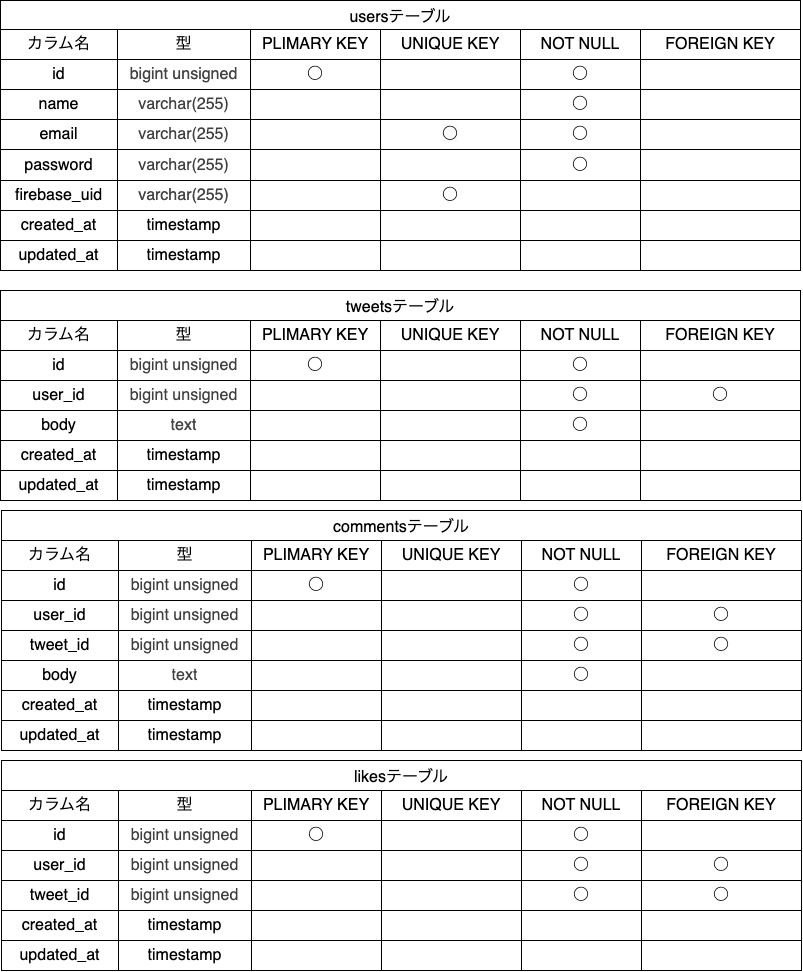

# SHARE

Twitter 風 SNS アプリ

## 作成した目的

コメントを投稿して、他のユーザーとコミュニケーションを取れるアプリ

## 機能一覧

- 新規会員登録
- ログイン
- ログアウト
- 投稿一覧取得
- 投稿追加
- 投稿削除
- いいね追加
- いいね削除
- コメント追加

## 使用技術(実行環境)

- PHP7.4.9
- Laravel8.83.29
- MySQL8.0.26
- JavaScript
- Next.js

／バージョンの記述

## テーブル設計



## ER 図


## 環境構築

**Docker ビルド**

1. https://github.com/youhonami/modan1.git

   - ターミナルで git clone git@github.com:youhonami/modan1.git を実行
   - リモートリポジトリを作成
   - ターミナルで git remote set-url origin 新規リポジトリの紐付け先リンク　を実行
   - ターミナルで git remote -v を実行。変更を確認。
   - ローカルリポジトリの変更を新しいリモートリポジトリに反映

   ```
   git status
   git add .
   git commit -m "例：リモートリポジトリの変更"
   git push origin main
   ```

2. DockerDesktop アプリを立ち上げる
3. `docker-compose up -d --build`

````
> _Mac の M1・M2 チップの PC の場合、`no matching manifest for linux/arm64/v8 in the manifest list entries`のメッセージが表示されビルドができないことがあります。
> エラーが発生する場合は、docker-compose.yml ファイルの「mysql」内に「platform」の項目を追加で記載してください_

```bash
mysql:
    platform: linux/x86_64(この文追加)
    image: mysql:8.0.26
    environment:
````

**Laravel 環境構築**

1. `docker-compose exec php bash`
2. `composer install`
   > \_composer install に失敗する場合は、laravel/sail を個別にインストールしてみてください。`composer require laravel/sail --dev`その後`composer install`
3. 「.env.example」ファイルを 「.env」ファイルに命名を変更。または、新しく.env ファイルを作成
4. .env に以下の環境変数を追加

```
DB_CONNECTION=mysql
DB_HOST=mysql
DB_PORT=3306
DB_DATABASE=laravel_db
DB_USERNAME=laravel_user
DB_PASSWORD=laravel_pass

MAIL_FROM_ADDRESS=認証メールの送信元となるメールアドレスを入力してください
```

5. アプリケーションキーの作成

```bash
php artisan key:generate
```

6. マイグレーションの実行

```bash
php artisan migrate
```

7. シーディングの実行

```bash
php artisan db:seed
```

8. ストレージのシンボリックリンクを作成

```bash
php artisan storage:link
```

／JavaScript、ノード js

## URL

- 開発環境:http://localhost
- phpMyAdmin:http://localhost:8080/
- MailHog:http://localhost:8025/
-

／ファイアーベース、localhost3000

## 備考
